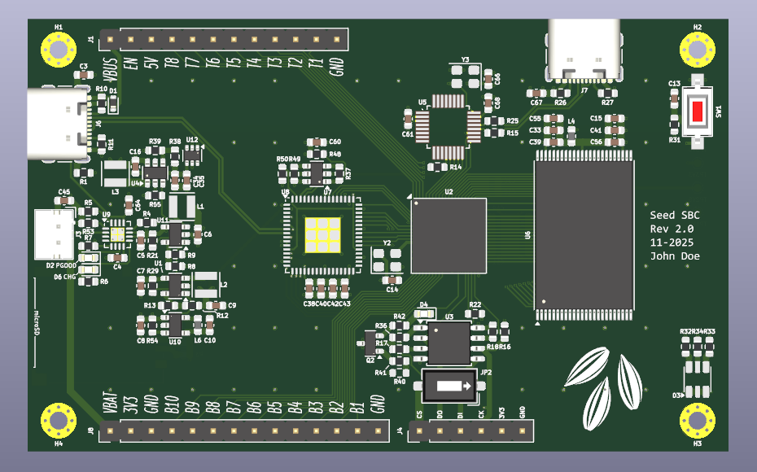
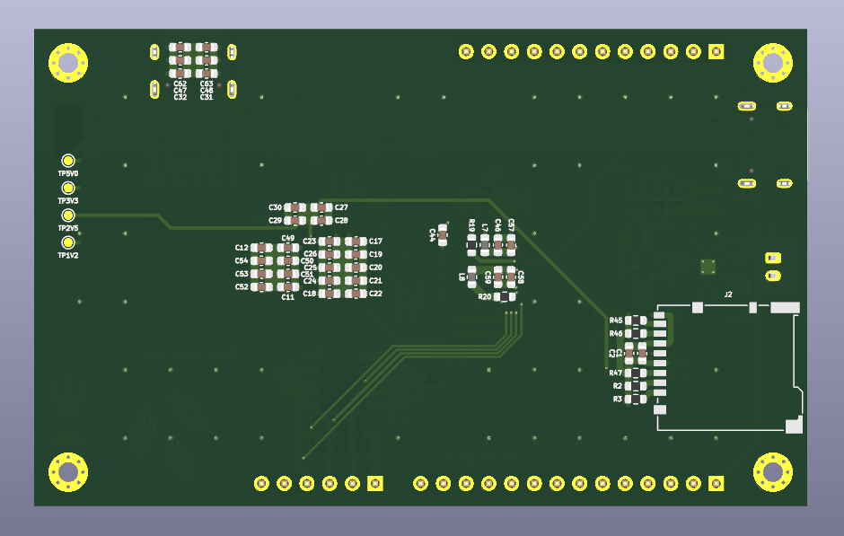

# SeedSBC
[OrangeCrab Web site](https://orangecrab-fpga.github.io/orangecrab-hardware/)

## ICE40HX8K FPGA development board.

## Latest Revision: 
* [SeedSBC rev2.0](hardware/rev2.0/)

Previous Revisions:
* [SeedSBC rev1.1](hardware/rev1.1/)
* [SeedSBC rev1.0](hardware/rev1.0/)

---

## What is it?
This is an Open Source Hardware single board computer and development board implementing the Lattice ICE40 FPGA. The board features regular I/O breakout pins, an SRAM unit, and a microSD MMC connector. The footprint is reminiscent of other "Altoids Tin" format SBCs.

## Hardware Overview
* Lattice ICE40HX8K FPGA in 121-Ball caBGA package

    * 7,680 - Logic Cells (LUT + Flip-Flop)
    * 32 - RAM4K Memory Blocks
    * 128k - RAM4K RAM bits
    * 2 - PLLs
    * 106 - Programmable I/O Pins
    * 13 - Differential Input Pairs
* SRAM Memory
    * 
* USB-C connection
    * 
* Non-Volatile Memory
    * asdf 
        * asdf
    * MicroSD socket
        * 4bit SD interface (CK, CMD, DAT0-3)
* Power supply
    * Battery charger (100mA), with LED charge indicators
    * Li-Ion battery connector
* 48MHz onboard oscillator
* Accessible 0.1" 2-wire SPI NVM programming breakout
* User I/O
    * 1x Button 
    * 1x RGB LED
    * 18x I/O on 0.1" headers
* Board Format
    * Dimensions: 86.36mm x 53.34mm (3.4" x 2.1")
    * 4x 2.2mm plated mounting holes
---

## Example code
Example code for Verilog, Litex, And RiscV can be found here:

* [ToDo]()

## Licence

 * None

